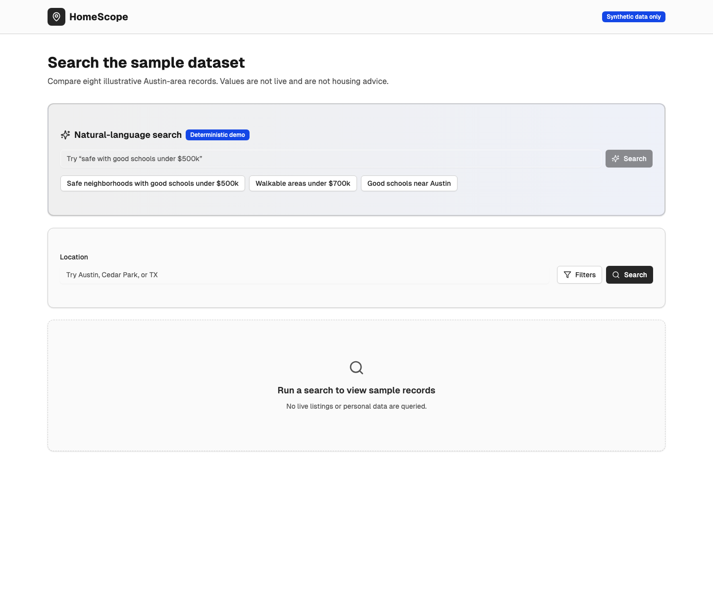
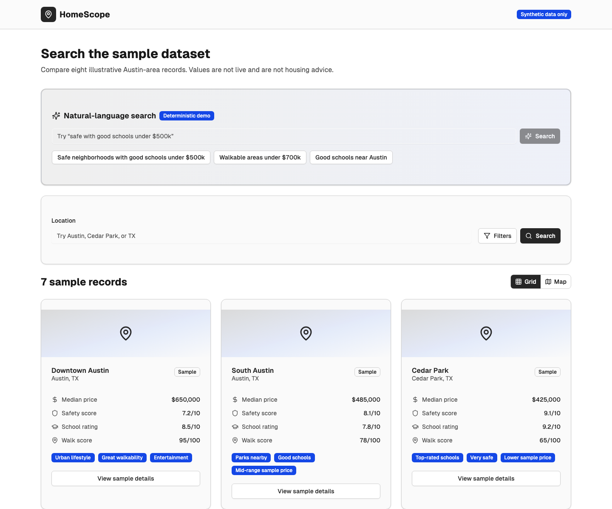

<!-- README.md -->
<!-- Documents the implemented HomeScope prototype, local setup, tests, and limits. -->
<!-- It does not claim live data, production deployment, users, benchmarks, or decision-grade accuracy. -->

# HomeScope

HomeScope is a local software prototype for exploring neighborhood-search interfaces. It lets a user filter eight
synthetic Austin-area records by price, school rating, safety score, and walkability, then compare results as cards or
on a simple coordinate map.

The project is for interface and retrieval experimentation. Its values are fixtures checked into this repository—not
live market data—and must not be used for housing, financial, or investment decisions.





## Implemented behavior

- Filter the bundled sample records by location, maximum price, minimum school rating, and minimum safety score.
- Parse a bounded set of natural-language phrases, such as “walkable areas under $700k,” into deterministic filters.
- View the same synthetic results as cards, on a relative coordinate map, or on a detail page.
- Query a separate FastAPI example that retrieves one of three synthetic statements with a local embedding model.
- Test the FastAPI contract with a fake vector store, so the test suite makes no model or network call.

## Architecture

```text
RAG-Application/
├── frontend/                 # Next.js 15 interface and synthetic fixtures
│   ├── app/                  # Pages plus the deterministic search endpoint
│   ├── components/           # Search controls, cards, and local map views
│   ├── lib/neighborhoods.ts  # The complete sample dataset
│   └── tests/                # Public-flow safety checks
├── backend/
│   ├── app.py                # FastAPI semantic-retrieval example
│   ├── requirements.txt      # Pinned runtime dependencies
│   └── tests/                # Deterministic API tests
└── .github/workflows/ci.yml # Pull-request-only validation
```

The Next.js search flow and the FastAPI retrieval example are independent demonstrations. The browser interface does
not call the FastAPI `/ask` endpoint.

## Run the frontend

Requirements: Node.js 20 or newer and Corepack.

```bash
cd frontend
corepack enable
corepack prepare pnpm@10.14.0 --activate
pnpm install --frozen-lockfile
pnpm dev
```

Open `http://127.0.0.1:3000`. Select **Open the prototype**, adjust the filters, and choose **Search**. The
natural-language field supports price ceilings, safety, schools, walkability, and a simple location phrase.

## Run the backend example

Requirements: Python 3.11. The first real retrieval request initializes a local sentence-transformer model and may
download its weights if they are not cached.

```bash
python3.11 -m venv .venv
source .venv/bin/activate
python -m pip install -r backend/requirements.txt
python -m uvicorn backend.app:app --host 127.0.0.1 --port 8000
```

The API exposes `GET /` for health, `POST /ask` for one nearest synthetic statement, and interactive documentation at
`http://127.0.0.1:8000/docs`.

Example request:

```bash
curl --request POST http://127.0.0.1:8000/ask \
  --header 'Content-Type: application/json' \
  --data '{"question":"Which sample mentions schools?"}'
```

## Validate a change

Backend tests use an injected fake vector store and do not load a model:

```bash
python3.11 -m venv .venv-test
source .venv-test/bin/activate
python -m pip install -r backend/requirements-test.txt
python -m pytest backend/tests
```

Frontend checks use the committed lockfile:

```bash
cd frontend
pnpm install --frozen-lockfile
pnpm test
pnpm lint
pnpm typecheck
pnpm build
```

Run all repository hooks with `pre-commit run --all-files`. The pull-request workflow runs the backend and frontend
checks; it has no push, schedule, or manual trigger.

## Limitations

- Every neighborhood name, price, score, label, coordinate, and image association in the UI is synthetic or
  illustrative.
- The deterministic phrase parser recognizes only the documented filter concepts; it is not a language model.
- The local map is a relative visualization, not a street map, property boundary, or navigation tool.
- Authentication, saved searches, dashboard content, and database scripts are prototype surfaces and are not required
  for the documented search walkthrough.
- The backend returns a stored statement rather than generating an answer and is not connected to the frontend.
- No live-data ingestion, accuracy audit, accessibility certification, load test, deployment, or security review is
  claimed.

## Security

Do not commit credentials or personal data. Use the private reporting route in [SECURITY.md](SECURITY.md) for a
suspected vulnerability. See [LICENSE](LICENSE) for the MIT license.
