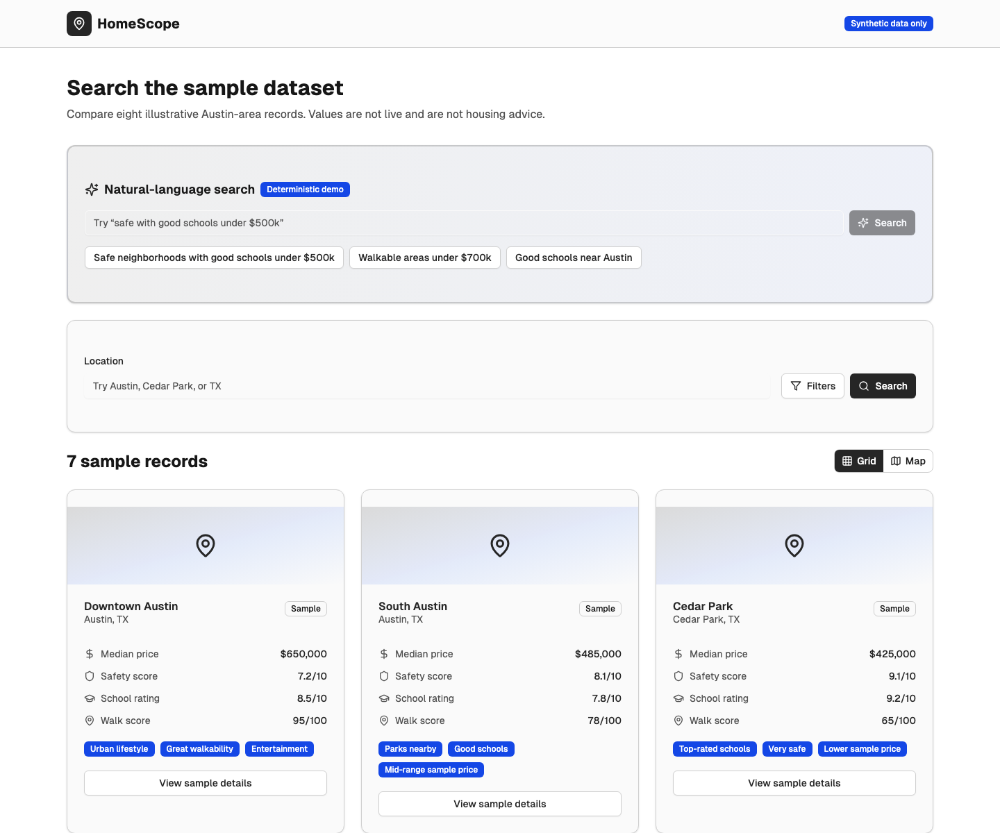
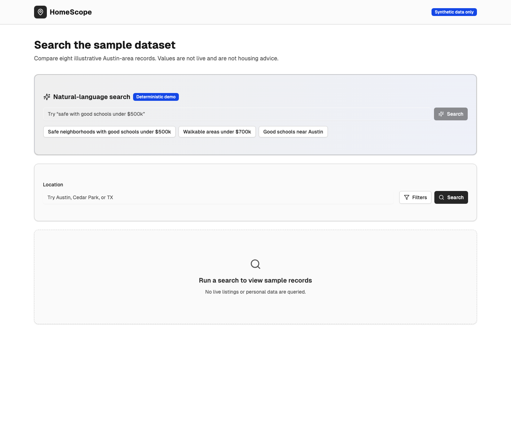

<div align="center">

# HomeScope

**Describe the neighborhood you want in plain words. See which sample neighborhoods match.**

HomeScope is a neighborhood-search prototype. Type "walkable areas under
$700k" or slide the price, school, safety and walkability filters, then compare
the matches as cards, on a map, or on a detail page. A separate FastAPI
example does local semantic retrieval with an embedding model.

[](https://github.com/T-Py-T/RAG-Application/actions/workflows/ci.yml)

[Getting started](#getting-started) ·
[Demo](#demo-ask-in-plain-words) ·
[Retrieval API](#the-retrieval-api-example) ·
[Contributing](#contributing)

</div>

> [!IMPORTANT]
> **Every record is synthetic.** The eight neighborhoods use Austin-area
> names, but every price, score, label, coordinate and image association is a
> fixture checked into this repository. HomeScope queries no live listings or
> personal data. Do not use it for housing, financial or investment decisions.



## Why try it

- **Plain-language filters.** A small, deterministic phrase parser turns
  "safe with good schools" or "under $500k near Austin" into filters, and
  tells you which filters it applied.
- **Three ways to compare.** A card grid, a relative coordinate map, and a
  detail page for each record.
- **Runs entirely on your machine.** The search flow calls no external AI,
  housing or identity service.
- **A retrieval playground on the side.** The FastAPI example embeds three
  sample statements with `sentence-transformers/all-MiniLM-L6-v2`, stores them
  in FAISS, and returns the nearest one to your question.
- **Tests that don't need a model.** The backend tests inject a fake vector
  store, so they never download weights or call the network.

## Getting started

### Prerequisites

- Node.js 22 (the version CI uses) and pnpm 11.19.0, as pinned by
  `packageManager` in `frontend/package.json`
- Python 3.11 for the backend example
- Optional: [`pre-commit`](https://pre-commit.com/)

### Run the frontend

```bash
git clone https://github.com/T-Py-T/RAG-Application.git
cd RAG-Application/frontend
npx -y pnpm@11.19.0 install --frozen-lockfile
npx -y pnpm@11.19.0 dev
```

Open `http://127.0.0.1:3000`, select **Open the prototype**, and run a search.
If you already use Corepack, `corepack enable` followed by plain `pnpm` picks
up the same pinned version.

Supabase authentication is optional. Without Supabase environment variables,
the app logs that it is continuing without authentication, and the search flow
works as normal.

## Demo: ask in plain words

**In the browser.** On `/search`, try one of the suggestion chips:

- *Safe neighborhoods with good schools under $500k*
- *Walkable areas under $700k*
- *Good schools near Austin*

Or type your own phrase. The parser understands price ceilings ("under",
"below", "less than"), "safe" / "low crime", "good school" / "excellent
school", "walkable" / "walkability", and a location after "in", "near" or
"around". Switch between **Grid** and **Map**, then open **View sample
details**.



**From the command line.** The search endpoint is a plain JSON API. With the
app running (`pnpm dev`, or `pnpm build` then `pnpm start`):

```bash
curl -s -X POST http://127.0.0.1:3000/api/ai-search \
  -H 'Content-Type: application/json' \
  -d '{"query":"walkable areas under $700k"}'
```

Abridged, this returns:

```text
interpretation: Applied: price at or below $700,000 · walk score at least 75
results:        Downtown Austin, South Austin, East Austin, Mueller
```

`{"query":"safe with good schools"}` applies "safety score at least 8 ·
school rating at least 8" and returns Cedar Park, Westlake, Mueller and
Round Rock. These names come from the synthetic fixture in
[`frontend/lib/neighborhoods.ts`](frontend/lib/neighborhoods.ts), so editing
that file changes the results.

## The retrieval API example

A small FastAPI service in [`backend/app.py`](backend/app.py). It is separate
from the frontend; the browser never calls it.

Not run for this README. The first `/ask` request loads a local
sentence-transformer model and may download its weights.

```bash
python3.11 -m venv .venv
source .venv/bin/activate
python -m pip install -r backend/requirements.txt
python -m uvicorn backend.app:app --host 127.0.0.1 --port 8000
```

```bash
curl --request POST http://127.0.0.1:8000/ask \
  --header 'Content-Type: application/json' \
  --data '{"question":"Which sample mentions schools?"}'
```

| Endpoint | Purpose |
| --- | --- |
| `GET /` | Health message |
| `POST /ask` | Returns the single nearest of three synthetic statements |
| `GET /docs` | Interactive OpenAPI docs |

It returns a stored statement; it doesn't generate an answer.

## Validate a change

Backend tests use a fake vector store and load no model:

```bash
python3.11 -m venv .venv-test
source .venv-test/bin/activate
python -m pip install -r backend/requirements-test.txt
python -m pytest backend/tests
```

Frontend checks use the committed lockfile:

```bash
cd frontend
npx -y pnpm@11.19.0 install --frozen-lockfile
npx -y pnpm@11.19.0 test        # public-flow safety checks
npx -y pnpm@11.19.0 lint        # source hygiene
npx -y pnpm@11.19.0 typecheck
npx -y pnpm@11.19.0 build
```

`pre-commit run --all-files` runs the repository hooks (not run for this
README). The pull-request workflow runs the backend and frontend checks above.

## How it fits together

```text
RAG-Application/
├── frontend/                 # Next.js interface and synthetic fixtures
│   ├── app/                  # Pages plus the deterministic /api/ai-search endpoint
│   ├── components/           # Search controls, cards, and local map views
│   ├── lib/neighborhoods.ts  # The complete sample dataset
│   └── tests/                # Public-flow safety checks
├── backend/
│   ├── app.py                # FastAPI semantic-retrieval example
│   ├── requirements.txt      # Pinned runtime dependencies
│   └── tests/                # Deterministic API tests
└── .github/workflows/ci.yml  # Pull-request-only validation
```

Built with Next.js, React, Tailwind CSS, Radix UI and Leaflet on the
frontend, and FastAPI, LangChain, FAISS and sentence-transformers in the
backend example.

## Limitations

- All neighborhood data is synthetic or illustrative.
- The phrase parser recognizes only the concepts listed above. It is not a
  language model.
- The map is a relative visualization, not a street map, property boundary or
  navigation tool.
- Authentication, saved searches, the dashboard and the SQL scripts are
  prototype surfaces. The search walkthrough doesn't need them.
- The search flow deliberately has no resident-composition filters, and
  `frontend/tests/public-safety.test.mjs` keeps it that way.
- The project claims no live-data ingestion, accuracy audit, accessibility
  certification, load test, deployment or security review.

## Contributing

Ideas welcome: smarter phrase parsing, better map views, accessibility
improvements, or wiring the retrieval example into the UI, all on synthetic
data.

1. Fork the repository and create a focused branch.
2. Make your change and run the checks that match it (backend `pytest`, or
   frontend `test` / `lint` / `typecheck` / `build`).
3. Don't commit credentials, personal data or live API keys, and keep all
   sample data clearly synthetic.
4. Open a pull request that says what changed and why.

See [CONTRIBUTING.md](CONTRIBUTING.md). Please report vulnerabilities
privately through [SECURITY.md](SECURITY.md).

## License

[MIT](LICENSE)
